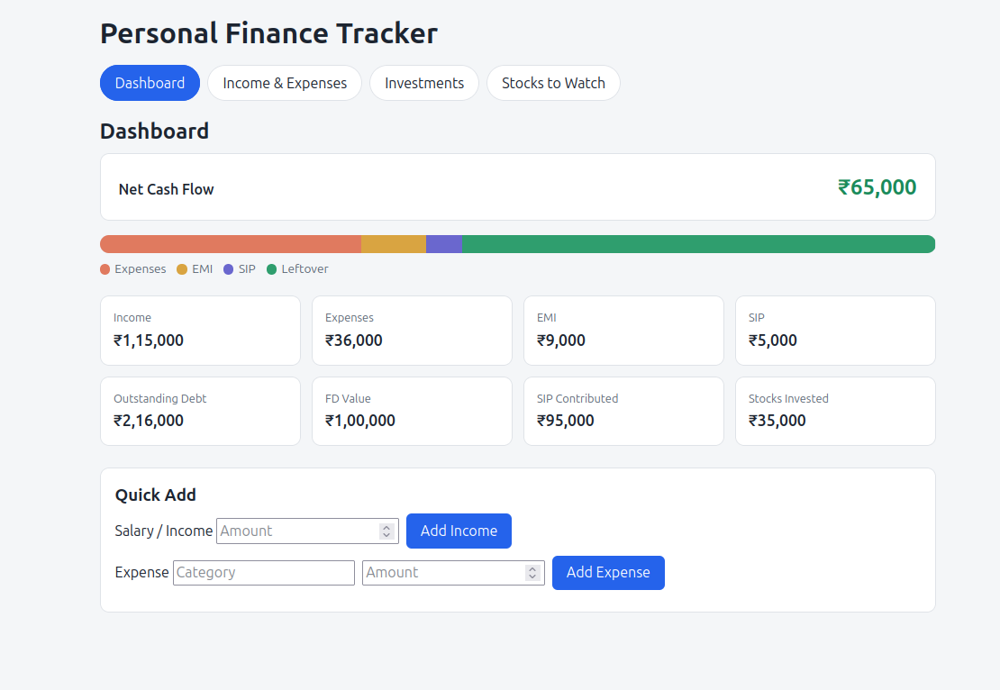
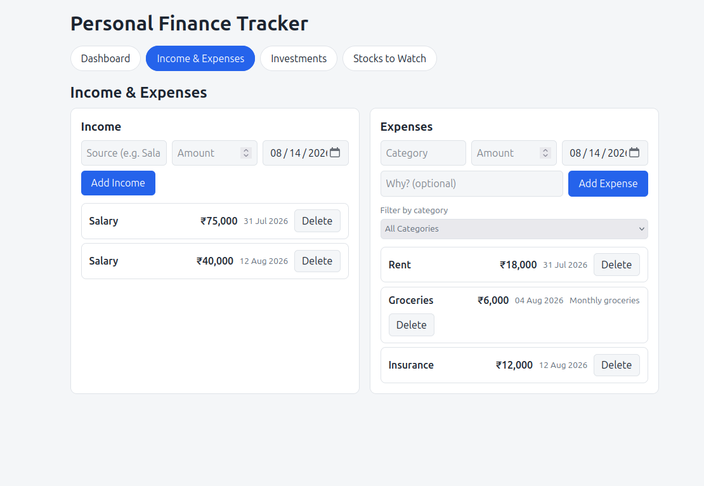
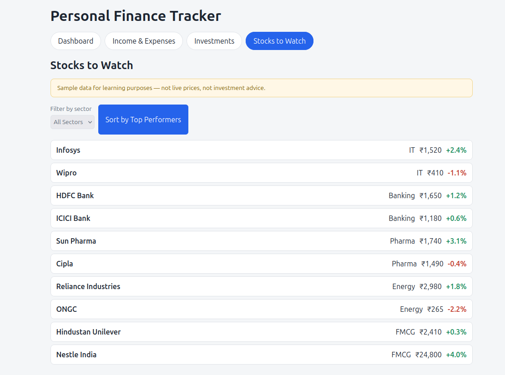
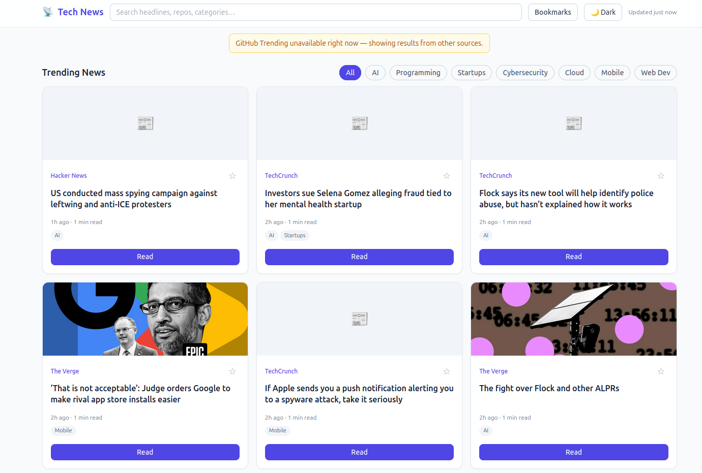
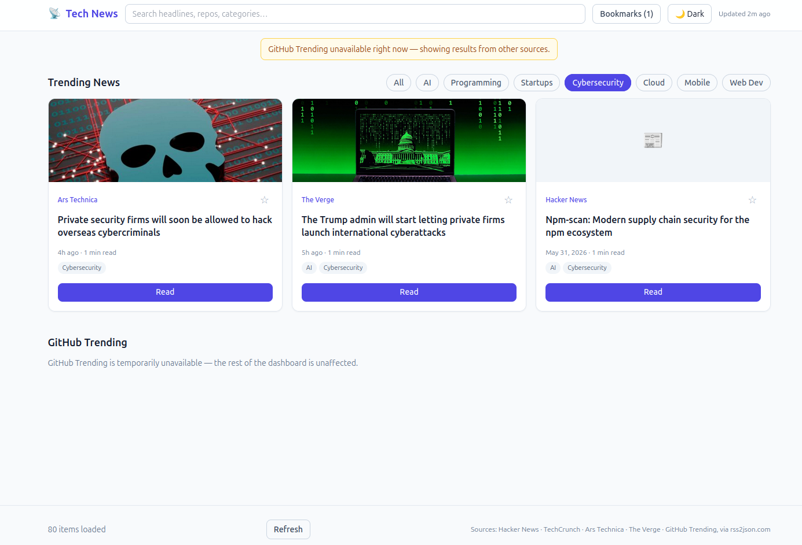
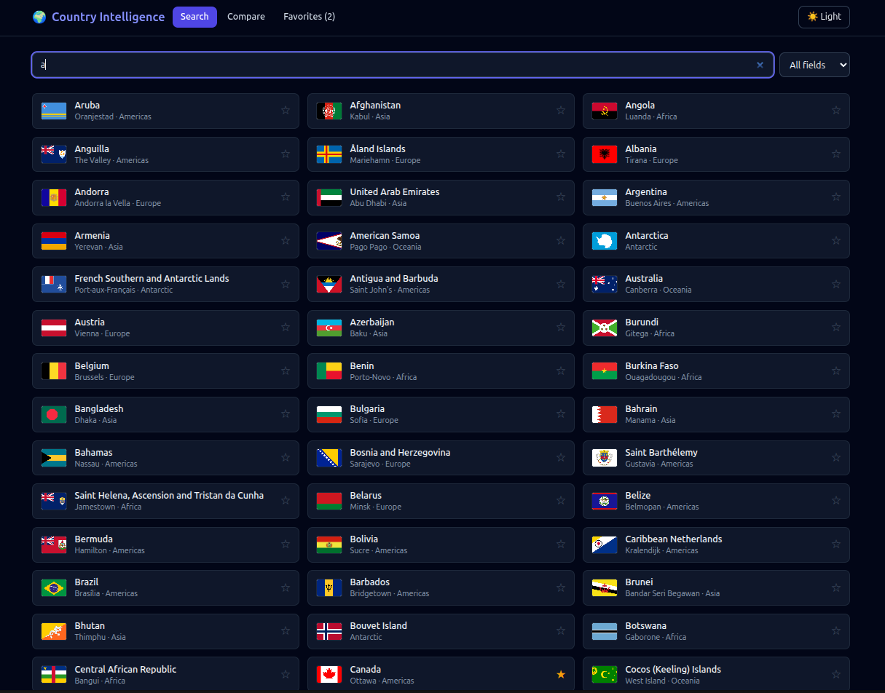
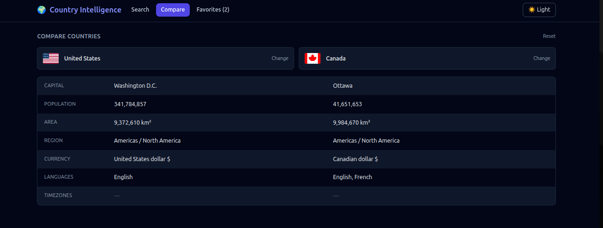
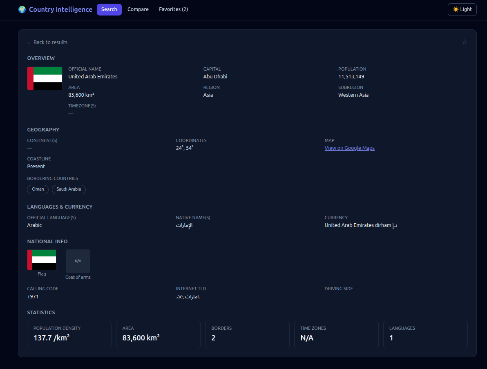
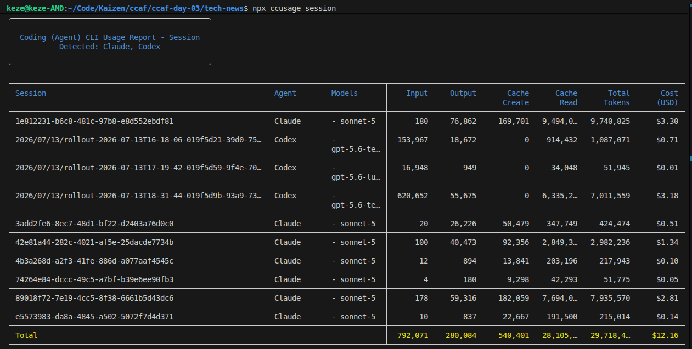

# CCAF Day 3 Outputs

## My workflow for the assignments

For each assignment I asked Claude Chat to create a `SPEC.md` after giving it the assignment brief. After iterating on the spec with Claude Chat, I switched to Claude Code in **Plan mode** to turn that spec into an implementation plan without writing any code. I then told Claude Code to implement the plan.

Every app below is the result of a single pass through this **spec → plan → implement** loop (one iteration, no rework).

---

## Repo structure

```
ccaf-day-03/
├── CLAUDE.md                 # Sipcode output-compression rules for this project
├── .sipcode/
│   └── install-state.json    # Sipcode install metadata (mode, timestamp)
├── readme-assets/            # Screenshots used in this README
├── finance-tracker/          # Assignment 1 — vanilla HTML/CSS/JS
│   ├── index.html
│   ├── css/styles.css
│   ├── js/{app,render,storage,utils}.js
│   └── SPEC.md
├── tech-news/                 # Assignment 2 — React + Vite + Tailwind
│   ├── src/{App.jsx,components,hooks,lib,state,main.jsx,index.css}
│   ├── package.json
│   └── SPEC.md
└── country-dashboard/         # Assignment 3 — React + Vite + Tailwind
    ├── src/{App.jsx,components,lib,state,main.jsx,index.css}
    ├── package.json
    └── SPEC.md
```

---

## Assignment 1 · Demo Project — Personal Finance Tracker

`finance-tracker/`

A single-page personal finance tracker built with **plain HTML, CSS, and JavaScript** — no backend, no frameworks, no libraries.

**Run it:** no build step or install required. Right-click `index.html` in VS Code → **Open with Live Server**.

**Core design principle — "the dashboard can't be wrong":** there is no stored total that can drift out of sync with reality. Every number on the dashboard is *derived* from the raw entries at render time — never cached or persisted as a separate value. One state object is the single source of truth, and the only allowed flow is **change state → save → redraw** (no direct DOM patching).

**Tabs & functionality:**
- **Dashboard** — headline Net Cash Flow (`income − expenses − EMI − SIP`, green/red by sign), a flow bar showing where money goes, eight summary cards (income, expenses, EMI, SIP, outstanding debt, FD value, SIP contributed, stocks invested), and Quick Add shortcuts for logging salary/expenses.
- **Income & Expenses** — add/delete entries; expenses capture category, date, and an optional "why" note; a category filter hides (never deletes) entries.
- **Investments** — four sub-sections with add/delete: Loans (EMI, interest rate, months remaining), FDs (principal, interest rate, start/maturity dates), SIPs (monthly contribution, start date), and My Stocks (name, sector, quantity, buy price — plus inline editing).
- **Stocks to Watch** — a fixed, hardcoded sample list (clearly labeled as learning data, not live prices or investment advice), with sort-by-performance and sector filtering.

**Other requirements:** amounts formatted in ₹ with Indian digit grouping, saved to/loaded from `localStorage` with safe fallback on corrupt data, all user input escaped before rendering, visible focus rings, and a responsive layout.

**Out of scope:** no backend/API/database, no external frameworks or chart libraries, no real-time stock prices, no investment advice or return projections.

| | |
|---|---|
|  |  |
|  |  |

---

## Assignment 2 · Homework 1 — Global Tech News Dashboard

`tech-news/`

A clean, filterable dashboard that aggregates tech news and trending GitHub repos from public feeds into one place. **No backend** — all fetching happens client-side; bookmarks persist via `localStorage`.

**Stack:** React · Tailwind CSS · Fetch API · `localStorage`

**Run it:**
```bash
npm run dev       # start the Vite dev server
npm run build     # production build
npm run preview   # preview the production build
```

**Data sources:** Hacker News, GitHub Trending (via community JSON mirrors), TechCrunch, Ars Technica, and The Verge — RSS-only sources are converted to JSON via a public RSS-to-JSON service where CORS allows.

**Layout & sections:**
- **Header** — logo, search bar, dark/light mode toggle, "last updated" timestamp.
- **Trending News** — per-article headline, source, publish time, estimated reading time, thumbnail, and a "Read" button linking out to the original article.
- **Category filter** — instant client-side filtering across AI, Programming, Startups, Cybersecurity, Cloud, Mobile, and Web Dev.
- **GitHub Trending** — repo name, star count, primary language, description, and stars gained today.
- **Search** — a single bar querying across headlines, repo names, and categories.
- **Bookmarks** — save/remove articles or repos, persisted in `localStorage`, no account or backend needed.
- **Footer** — total items loaded, manual refresh control, source credits/attribution.

**Other requirements:** infinite scroll (not pagination), skeleton loading states while feeds fetch, dark/light mode across the whole dashboard, responsive layout, and graceful degradation if a single feed fails.

**Out of scope:** no backend/proxy/database, no accounts or cross-device sync, no push notifications or real-time streaming.

| | |
|---|---|
|  |  |

---

## Assignment 3 · Homework 2 — Country Intelligence Dashboard

`country-dashboard/`

Search any country and instantly see its demographics, geography, economy, and national symbols — with the ability to compare two countries side by side. **No backend, no database, no login** — purely client-side, with favorites persisted via `localStorage`.

**Stack:** React · Tailwind CSS · Fetch API · `localStorage`

**Run it:**
```bash
npm run dev       # start the Vite dev server
npm run build     # production build
npm run preview   # preview the production build
```

**Data sources:** REST Countries API, open GeoJSON and flag sets, and timezone/currency data — all fetched directly from public, no-auth endpoints at request time.

**Layout & sections:**
- **Search** — by name, capital, region, currency, or language, with instant results as you type.
- **Overview** — flag, official name, capital, population, area, region, subregion, timezone.
- **Geography** — continent, bordering countries, coordinates, map link, coastline (as data allows).
- **Languages & Currency** — official/native language names, currency name and symbol.
- **National Info** — flag, coat of arms, calling code, internet TLD, driving side.
- **Statistics** — card-based summary of population density, area, number of borders, timezones, and languages.
- **Compare** — pick two countries and view key fields side by side.
- **Favorites** — save/remove countries, persisted in `localStorage`, restored on load.

**Other requirements:** dark/light mode across the app, responsive layout, graceful handling of fields missing from the API (e.g. no borders for an island nation), and no local duplication of country data beyond the current session/cache.

**Out of scope:** no backend/proxy/database, no accounts or authentication, read-only (no editing country data), no real-time counters — reflects whatever the public dataset currently reports.

| | |
|---|---|
|  |  |
|  | |

---

## Assignment 4 · NPX & Token Usage



---

## Assignment 5 · Sipcode implementation

I gave a crude version of this README to Claude Code and built a readme-writer agent to handle this task. I then handed the task to that agent twice — once **without** Sipcode installed, and once **with** it — to compare results.

**What's installed:** `.sipcode/install-state.json` records the install:

```json
{
  "schemaVersion": "sipcode-install-state/1",
  "rulesInstalledAt": "2026-08-14T04:33:41.907Z",
  "rulesMode": "default"
}
```

This is Sipcode's own state file (mode `default`, installed 2026-08-14) — it doesn't contain the rules themselves, just tracks that the `default`-mode rules block has been written into `CLAUDE.md` and when.

The actual behavior change lives in the **"Sipcode Output Compression"** block at the top of `CLAUDE.md`. In `default` mode it instructs Claude Code to, for every response in this project:
1. **Diff-only edits** — output only the changed hunk plus a few lines of context, never the whole file back.
2. **No preamble** — skip "I'll help with that" / "sure" / "here's what I did."
3. **No post-amble** — no unsolicited recap of what was just done.
4. **Code over prose** — when the answer is code, lead with the code block, explanation after.
5. **Bullets over paragraphs** for options, steps, or trade-offs.
6. **One canonical example**, not three variants.
7. **No filler verbs** — drop "let me", "I'll go ahead and", "I'm going to."

The rules are switchable (`npx sipcode rules --mode <m>`) and removable (`npx sipcode rules --uninstall`) without touching the rest of the project.

**Pre-Sipcode:**
```
keze@keze-AMD:~/Code/Kaizen/ccaf/ccaf-day-03$ npx ccusage session -i 1e95420a-556e-423c-8b0d-ce623b238a7f
Claude Code Session Usage - 1e95420a-556e-423c-8b0d-ce623b238a7f
Total Cost: $0.16
Total Tokens: 214,165
Total Entries: 10
```

**With Sipcode:**
```
keze@keze-AMD:~/Code/Kaizen/ccaf/ccaf-day-03$ npx ccusage session -i 59746e5d-d02d-40a0-a6cc-f73a68c6b8fd
Claude Code Session Usage - 59746e5d-d02d-40a0-a6cc-f73a68c6b8fd
Total Cost: $0.16
Total Tokens: 186,416
Total Entries: 9
```

This specific comparison isn't ideal — both runs had very few iterations, so it may not represent Sipcode's true impact — but the Sipcode run used fewer tokens across fewer entries for the same task.
